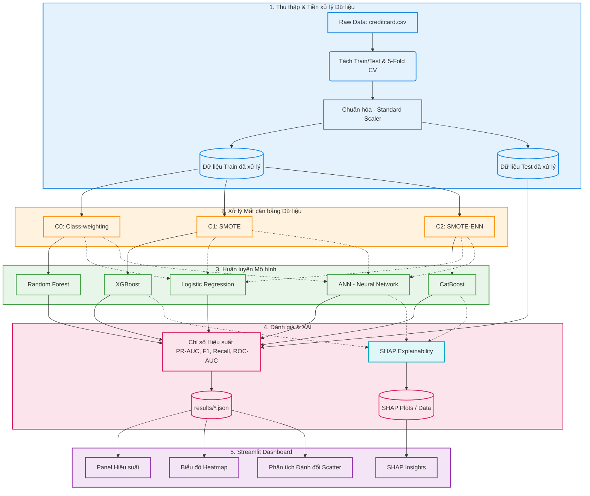

# Kiến trúc Hệ thống: Fraud-XAI Anomaly Detection Framework

Tài liệu này trình bày tổng quan về kiến trúc và luồng xử lý (pipeline) từ đầu đến cuối của hệ thống Fraud-XAI trong việc phát hiện gian lận thẻ tín dụng dưới tác động của mất cân bằng dữ liệu.

## Tổng quan Kiến trúc

## Các Bước Chi Tiết Trong Pipeline

### 1. Thu thập & Tiền xử lý Dữ liệu (`src/preprocess.py`)
- **Tập dữ liệu:** Sử dụng bộ dữ liệu Kaggle `creditcard.csv` (mất cân bằng cực cao: chỉ có 0.17% là gian lận).
- **Phân chia & Cross-Validation:** Hàm `load_and_split()` tách dữ liệu kết hợp cơ chế 5-Fold Cross-Validation có phân tầng (stratification) để giữ nguyên tỷ lệ phân bổ nhãn và đảm bảo độ tin cậy của mô hình.
- **Chuẩn hóa (Scaling):** Hàm `scale_features()` áp dụng `StandardScaler` lên các đặc trưng `Amount` và `Time` (và các đặc trưng `V1-V28` khác nếu cần), đảm bảo phân phối có trung bình bằng 0 và phương sai bằng 1. Tập kiểm thử (test set) được chuẩn hóa nghiêm ngặt dựa trên các thông số thống kê từ tập huấn luyện (train set).

### 2. Xử lý Mất cân bằng Dữ liệu (`src/imbalance.py`)
Để giải quyết vấn đề mất cân bằng lớp dữ liệu nghiêm trọng, ba điều kiện thử nghiệm riêng biệt được áp dụng cho tập dữ liệu huấn luyện:
- **C0 (Class-weighting):** Dữ liệu huấn luyện được giữ nguyên trạng thái mất cân bằng gốc. Sự mất cân bằng này được xử lý trực tiếp bên trong các thuật toán máy học thông qua việc tinh chỉnh siêu tham số (ví dụ: `scale_pos_weight` trong XGBoost, `class_weight='balanced'` trong RF và LR).
- **C1 (SMOTE):** Kỹ thuật Oversampling lấy mẫu thiểu số tổng hợp (Synthetic Minority Over-sampling Technique) được sử dụng để tổng hợp ra các mẫu gian lận mới, bắt buộc tỷ lệ đạt 1:1.
- **C2 (SMOTE-ENN):** Kỹ thuật lai ghép sử dụng SMOTE để oversample và sau đó áp dụng Edited Nearest Neighbors (ENN) để dọn dẹp các mẫu nhiễu/nằm ở vùng biên, giúp tạo ra các ranh giới quyết định (decision boundaries) rõ ràng hơn.
*(Lưu ý: Tập kiểm thử (Test set) không bao giờ bị can thiệp resample, nhằm bảo tồn phân phối dữ liệu thực tế).*

### 3. Huấn luyện Mô hình (`src/models.py`, `src/models_dl.py`)
Năm mô hình tạo thành nòng cốt của các thử nghiệm:
- **Random Forest (RF):** Đóng vai trò là mô hình ensemble (tổ hợp) cơ bản, cực kỳ bền vững và ổn định.
- **XGBoost (XGB):** Mô hình Tree-based boosting, nổi tiếng với hiệu suất cao nhưng thường nhạy cảm với nhiễu.
- **CatBoost:** Mô hình boosting tiên tiến giúp cân bằng giữa độ chính xác dự đoán và tính minh bạch/giải thích.
- **Logistic Regression (LR):** Mô hình tuyến tính cơ sở (baseline) dùng để so sánh chéo giữa các họ thuật toán.
- **Artificial Neural Network (ANN):** Mạng nơ-ron sâu (`src/models_dl.py`) để nắm bắt các biểu diễn và quan hệ phi tuyến tính phức tạp trong dữ liệu.

Mỗi mô hình được đánh giá dưới cả 3 điều kiện xử lý mất cân bằng, kết hợp với 5-Folds CV (tổng cộng 75 cấu hình thử nghiệm: 5 Models × 3 Conditions × 5 Folds). Các siêu tham số (hyperparameters) được tinh chỉnh để đảm bảo sự công bằng khi so sánh hiệu năng.

### 4. Đánh giá & Giải thích XAI (`src/evaluate.py`, `src/explain.py`)
- **Đánh giá Hiệu suất:** Đối với mỗi mẫu thử nghiệm, điểm xác suất sẽ được tính toán và chuyển đổi thành các chỉ số hiệu suất: `PR-AUC`, `ROC-AUC`, `Recall`, và `F1`. Trong đó `PR-AUC` đóng vai trò là thước đo hiệu suất chính đối với dữ liệu cực kỳ mất cân bằng.
- **Giải thích Mô hình (SHAP):** Sử dụng `SHAP` (`src/explain.py`) để giải thích quyết định của các mô hình (đặc biệt hữu ích cho XGBoost/CatBoost/ANN), cung cấp cái nhìn minh bạch về tầm quan trọng của các đặc trưng (feature importance) và cách chúng tác động lên xác suất dự đoán gian lận.

### 5. Streamlit Dashboard Tương tác (`dashboard/app.py`)
- **Tab 1 (Performance):** Biểu đồ Bar chart động để so sánh các chỉ số PR-AUC, F1-Score, Recall và ROC-AUC giữa các cấu hình.
- **Tab 2 (Detailed Analysis):** Biểu đồ Heatmap hiển thị sự chênh lệch hiệu năng và biểu đồ Scatter phân tích sự đánh đổi giữa PR-AUC và F1.
- **Tab 3 (Full Results Table):** Bảng tổng hợp đầy đủ kết quả chỉ số kèm theo tính năng tải về (Download) file CSV.
- **Tab 4 (Explainability - SHAP):** Giao diện tương tác trực quan hiển thị các biểu đồ giải thích SHAP giúp phân tích nguyên nhân quyết định gian lận của mô hình.
